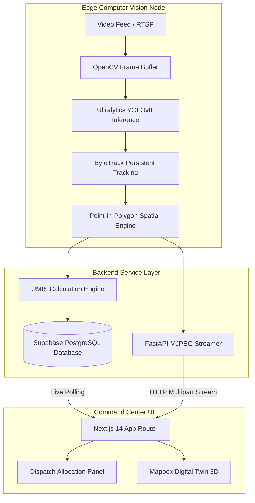
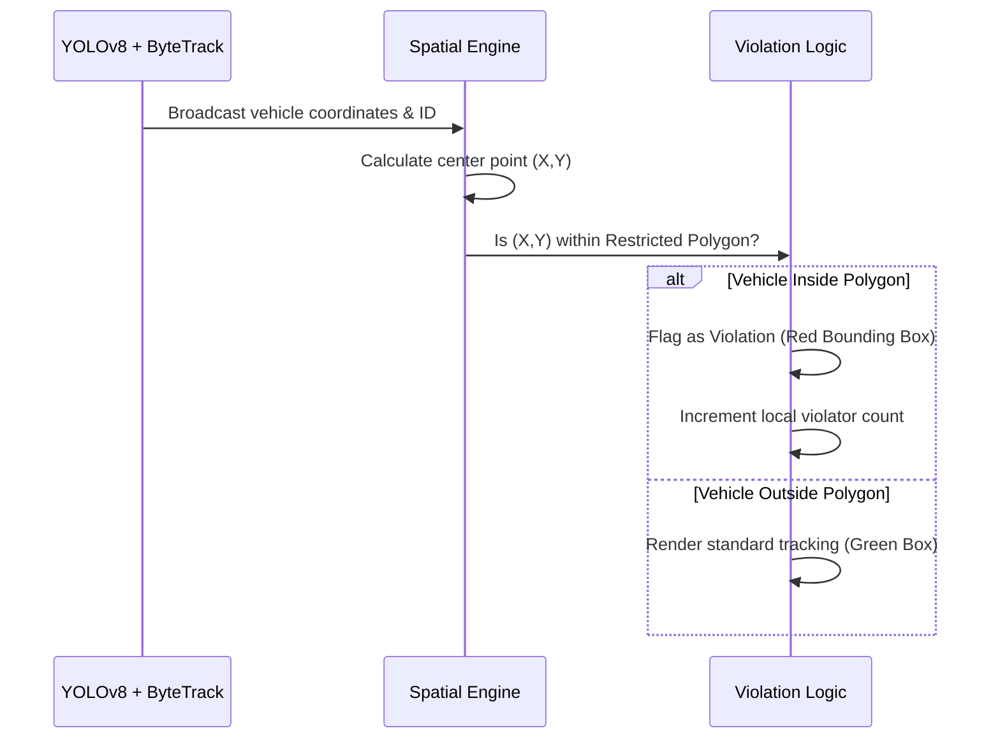
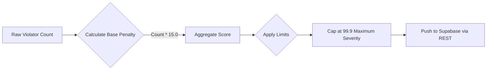

# ParkOptima AI: Autonomous Urban Mobility & Traffic Enforcement System

## Executive Summary

ParkOptima AI is an enterprise-grade, real-time Computer Vision and distributed edge computing platform designed to autonomously detect, track, and mitigate illegal parking and urban traffic congestion. Built to scale across metropolitan infrastructure, the system leverages state-of-the-art neural networks, geometric mathematics, and real-time cloud synchronization to dispatch enforcement units dynamically based on proprietary severity algorithms.

## Core System Architecture

The architecture is strictly decoupled into three highly optimized layers: the Edge Computer Vision Node, the Backend Service Layer, and the Command Center Frontend.

## Technical Implementation Details

### 1. The Computer Vision Pipeline
The system utilizes YOLOv8 (You Only Look Once) for sub-millisecond object detection, heavily optimized to focus specifically on vehicular classifications (cars, trucks, buses, motorcycles). 

To ensure accuracy across frames, the ByteTrack algorithm is implemented. ByteTrack assigns persistent tracking IDs to individual vehicles, ensuring that the system understands the spatial-temporal relationship of each object rather than simply counting bounding boxes.

### 2. Spatial Engine & Violation Detection
The spatial engine maps a calibrated Cartesian coordinate polygon over the video feed, representing restricted transit lanes or no-parking zones. 

### 3. Urban Mobility Impact Score (UMIS)
ParkOptima AI does not merely count cars; it calculates the severity of the obstruction using the proprietary UMIS algorithm. This score scales dynamically based on the volume of obstructing vehicles and dictates the priority level for the automated dispatch engine.

### 4. Real-Time MJPEG Telemetry
Instead of relying on heavy native desktop GUI applications (like X11), the edge node converts the annotated AI frames into JPEG byte buffers in a dedicated background thread. FastAPI streams these buffers via `multipart/x-mixed-replace`, allowing the web-based Command Center to natively decode and render the live AI feed at 30+ FPS seamlessly.

## Setup and Execution Guide

To deploy the system locally, both the edge node backend and the command center frontend must run concurrently.

### Backend Setup (FastAPI + YOLOv8)
1. Navigate to the backend directory: `cd backend`
2. Activate the Python environment: `source venv/bin/activate`
3. Launch the edge server: `uvicorn app.main:app --reload`
*(Note: The YOLOv8 weights will auto-download on the first execution).*

### Frontend Setup (Next.js)
1. Navigate to the frontend directory: `cd frontend`
2. Install Node dependencies: `npm install`
3. Launch the web server: `npm run dev`
4. Access the Command Center via `http://localhost:3000`

## Scalability and Future Roadmap
- **Multi-Node Deployment**: The edge architecture allows infinite deployment of lightweight camera nodes, all syncing to a centralized Supabase cluster.
- **Hardware Acceleration**: Integration with TensorRT for edge devices (NVIDIA Jetson) to increase frame processing velocity.
- **Automated LPR**: Planned integration of License Plate Recognition (LPR) OCR to automatically issue citations via the violation engine.
